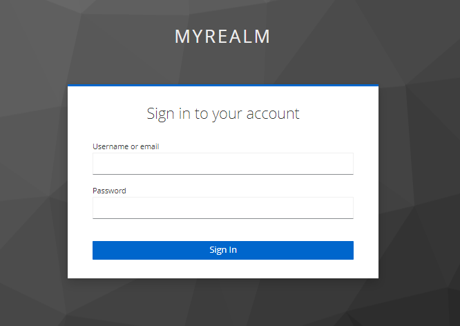

## OAuth2 Client for Keycloak

### Description

This project is a client for OAuth2 provided by Keycloak. It uses Spring Boot for this purpose.

### Configure project

To set up the project, you will need to install Keycloak and this Application, following the requirements and steps above.

#### Requirements:

* Docker
* Java 17
* Gradle

#### Keycloak

Use this link to initialize and start the Keycloak in your machine:

[Keycloak - Docker](https://www.keycloak.org/getting-started/getting-started-docker)

##### Running with Custom theme

Go to keycloak-theme and run `docker-compose up`

This command will create the keycloak with mysql database and with a custom theme.

Change the theme: You should go to Realm settings >  Themes > Login theme

#### Spring Boot Client

Execute `./gradlew bootRun`

Notes: If you wanna to package the application, run this command: `./gradlew build`

### Running the application

At this point you should have already the Keycloak and the spring application running.

Access from your browser the url: `http://localhost:8090/`

It will redirect you to the Keycloak url

Something like this:
`http://localhost:8080/realms/myrealm/protocol/openid-connect/auth?response_type=code&client_id=myclient&scope=openid%20profile%20email%20roles&state=QbKiLpoxFTswgum5K9qwtLPRKKPk-bShfDfq9NmhXRs%3D&redirect_uri=http://localhost:8090/login/oauth2/code/keycloak&nonce=A-9khzl9OrnfgfJyNCv6TJy0jViNalf2-YrzsN1jGgo`

All the parameters in the URL is configured bases on the application.yaml.

* **response_type:** This parameter is included by Spring OAuth
* **client_id:** Based on application.yaml 
* **scope:** Based on application.yaml
* **redirect_uri:** This parameter is included by Spring OAuth to get the information from the callback

But we have also two parameters that are included by Spring application:

* **state:** RECOMMENDED. Opaque value used to maintain state between the request and the callback. Typically, Cross-Site Request Forgery (CSRF, XSRF) mitigation is done by cryptographically binding the value of this parameter with a browser cookie.
* **nonce:** String value used to associate a Client session with an ID Token, and to mitigate replay attacks.

In the callbackUrl, we will have something like this: `http://localhost:8090/teste?state=__FYubYGtjQI4oYOcLSla_D0hVXNEh2WhZgi12OuIyQ%3D&session_state=058a2f21-2ab4-41bc-9b8a-abbe294362dc&code=432b4280-295a-44dc-8d04-a3b1b233c103.058a2f21-2ab4-41bc-9b8a-abbe294362dc.020d79f9-de50-4015-ac78-b98bcf4b465e` \

* **state:** is used to verify if it matches with the used before.\
* **code:** is used to do the exchange token and retrieve the ID Token and/or AccessToken.

The Spring OAuth2 is responsible to encapsulate the exchange token done by the callbackUrl.

We can access the ID token with this method: `DefaultOidcUser.getIdToken().getTokenValue()`

**IdToken:** The ID Token take the form of a JWT and contains information about the user.

### Technologies:

* Spring Boot 3.0
* Keycloak 20.0.3

#### References:

* [The OAuth 2.0 Authorization Framework](https://www.rfc-editor.org/rfc/rfc6749)
* [A Quick Guide to Using Keycloak With Spring Boot](https://www.baeldung.com/spring-boot-keycloak)
* [OpenID Connect Core 1.0](https://openid.net/specs/openid-connect-core-1_0.html#CodeFlowSteps)
* [Prevent Attacks and Redirect Users with OAuth 2.0 State Parameters](https://auth0.com/docs/secure/attack-protection/state-parameters)
* [OAuth 2.0 Resource Server](https://docs.spring.io/spring-security/reference/servlet/oauth2/resource-server/index.html)
* [OAuth 2.0 authorisation endpoint](https://connect2id.com/products/server/docs/api/authorization)
* [ID Token and Access Token: What's the Difference?](https://auth0.com/blog/id-token-access-token-what-is-the-difference/)
* [Spring Security - Authorized Clients](https://docs.spring.io/spring-security/reference/reactive/oauth2/client/authorized-clients.html#oauth2Client-registered-authorized-client)